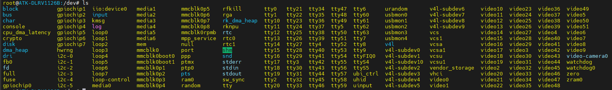
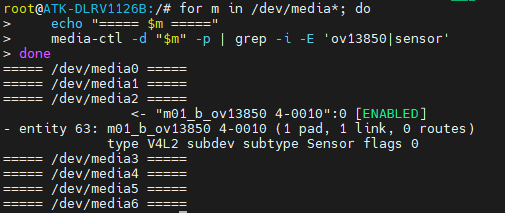
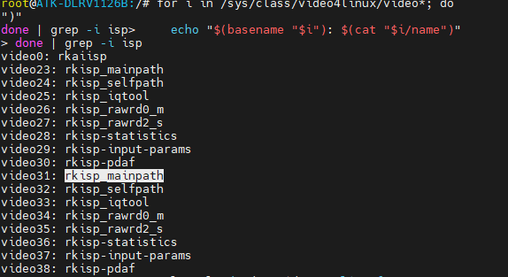

# 当前采集工具（v0.8）

通用采集句柄实现在 `modules/capture/src/capture.c`，通过 `capture_backend.h` 注入后端。
`capture_cli.c` 负责两种入口共用的信号、帧消费、输出和统计，不包含 V4L2 类型。

V4L2 入口显式选择 `rtctrl_v4l2_open`：

`main.c` 包含 `rtctrl/adapters/v4l2/capture.h`，并链接 `rtctrl_vision_v4l2`。
创建接口属于 `adapters/capture/v4l2/`，不随平台公共头文件安装。
通用消费者 `capture_cli.c` 只依赖 `rtctrl_capture`。

```sh
cmake --preset vision-node
cmake --build --preset vision-node
./build/vision-node/rtctrl_camera_capture /dev/video31 /tmp/frame.nv12
```

无硬件入口选择 `rtctrl_synthetic_open`：

```sh
cmake --preset vision-synthetic
cmake --build --preset vision-synthetic
./build/vision-synthetic/rtctrl_camera_synthetic /tmp/frame.gray
```

设备路径需根据板端拓扑确认。V4L2 保留当前格式；生成后端输出 64×48 GRAY8，
无节流、无采集时钟。两者采集 70 帧，可选保存首张非损坏帧及 schema_version=2
的 `.json` 元数据。输出扩展名不代表格式转换，保存仍是诊断用途同步 I/O。
公共 `pixel_format` 与颜色字段按 `image_format.h` 解释，`native_format` 仅供诊断。

可继续 `cmake -S apps/camera_capture -B build/camera-standalone` 独立 C 构建；
加 `-DRTCTRL_ENABLE_V4L2=OFF` 可只构建无硬件入口。
资源/借用契约和扩展方式见 `docs/architecture.md` 与 ADR-0006。

以下保留硬件探索笔记，其中的节点、格式和旧实现步骤不作为当前程序的行为说明。

---

# capture camera

这部分是要写一个最小采集程序，相当于做一个基线，测量缓冲区流转

我觉得先找到设备，然后再read设备

## 我怎么知道我这个摄像头是哪个设备呢



这里这么多设备（节点）根本不知道哪个是哪个

不要用`ls`

可以执行这个

```bash
v4l2-ctl --list-devices
```

但是你依然不知道它的关系是什么，哪个是给用户态用的

我们唯一知道的就是 sensor 的名字， ov13850

拓扑关系在 mediaX 里面

```bash
for m in /dev/media*; do
    echo "===== $m ====="
    media-ctl -d "$m" -p | grep -i -E 'ov13850|sensor'
done
```

假设结果发现：



那么马上知道：

```text
OV13850
↓
属于 /dev/media2 这张 media graph
```

从这个命令能看出来了吧
> meida 是描述一整套摄像头硬件流水线的拓扑图

### 具体看拓扑图

前面筛选了，现在就要具体看一下这张拓扑图了

```bash
media-ctl -d /dev/media2 -p
```

以 `ov13850` 为起点，顺着箭头往下找
像这样

```bash
root@ATK-DLRV1126B:/# media-ctl -d /dev/media2 -p
Media controller API version 6.1.141

Media device information
------------------------
driver          rkcif
model           rkcif-mipi-lvds2
serial
bus info        platform:rkcif-mipi-lvds2
hw revision     0x0
driver version  6.1.141

Device topology
- entity 1: stream_cif_mipi_id0 (1 pad, 11 links)
            type Node subtype V4L flags 0
            device node name /dev/video12
        pad0: SINK
                <- "rockchip-mipi-csi2":1 [ENABLED]
                <- "rockchip-mipi-csi2":2 []
                <- "rockchip-mipi-csi2":3 []
                <- "rockchip-mipi-csi2":4 []
                <- "rockchip-mipi-csi2":5 []
                <- "rockchip-mipi-csi2":6 []
                <- "rockchip-mipi-csi2":7 []
                <- "rockchip-mipi-csi2":8 []
                <- "rockchip-mipi-csi2":9 []
                <- "rockchip-mipi-csi2":10 []
                <- "rockchip-mipi-csi2":11 []

- entity 5: stream_cif_mipi_id1 (1 pad, 11 links)
            type Node subtype V4L flags 0
            device node name /dev/video13
        pad0: SINK
                <- "rockchip-mipi-csi2":1 []
                <- "rockchip-mipi-csi2":2 [ENABLED]
                <- "rockchip-mipi-csi2":3 []
                <- "rockchip-mipi-csi2":4 []
                <- "rockchip-mipi-csi2":5 []
                <- "rockchip-mipi-csi2":6 []
                <- "rockchip-mipi-csi2":7 []
                <- "rockchip-mipi-csi2":8 []
                <- "rockchip-mipi-csi2":9 []
                <- "rockchip-mipi-csi2":10 []
                <- "rockchip-mipi-csi2":11 []

- entity 9: stream_cif_mipi_id2 (1 pad, 11 links)
            type Node subtype V4L flags 0
            device node name /dev/video14
        pad0: SINK
                <- "rockchip-mipi-csi2":1 []
                <- "rockchip-mipi-csi2":2 []
                <- "rockchip-mipi-csi2":3 [ENABLED]
                <- "rockchip-mipi-csi2":4 []
                <- "rockchip-mipi-csi2":5 []
                <- "rockchip-mipi-csi2":6 []
                <- "rockchip-mipi-csi2":7 []
                <- "rockchip-mipi-csi2":8 []
                <- "rockchip-mipi-csi2":9 []
                <- "rockchip-mipi-csi2":10 []
                <- "rockchip-mipi-csi2":11 []

- entity 13: stream_cif_mipi_id3 (1 pad, 11 links)
             type Node subtype V4L flags 0
             device node name /dev/video15
        pad0: SINK
                <- "rockchip-mipi-csi2":1 []
                <- "rockchip-mipi-csi2":2 []
                <- "rockchip-mipi-csi2":3 []
                <- "rockchip-mipi-csi2":4 [ENABLED]
                <- "rockchip-mipi-csi2":5 []
                <- "rockchip-mipi-csi2":6 []
                <- "rockchip-mipi-csi2":7 []
                <- "rockchip-mipi-csi2":8 []
                <- "rockchip-mipi-csi2":9 []
                <- "rockchip-mipi-csi2":10 []
                <- "rockchip-mipi-csi2":11 []

- entity 17: rkcif_scale_ch0 (1 pad, 11 links)
             type Node subtype V4L flags 0
             device node name /dev/video16
        pad0: SINK
                <- "rockchip-mipi-csi2":1 []
                <- "rockchip-mipi-csi2":2 []
                <- "rockchip-mipi-csi2":3 []
                <- "rockchip-mipi-csi2":4 []
                <- "rockchip-mipi-csi2":5 [ENABLED]
                <- "rockchip-mipi-csi2":6 []
                <- "rockchip-mipi-csi2":7 []
                <- "rockchip-mipi-csi2":8 []
                <- "rockchip-mipi-csi2":9 []
                <- "rockchip-mipi-csi2":10 []
                <- "rockchip-mipi-csi2":11 []

- entity 21: rkcif_scale_ch1 (1 pad, 11 links)
             type Node subtype V4L flags 0
             device node name /dev/video17
        pad0: SINK
                <- "rockchip-mipi-csi2":1 []
                <- "rockchip-mipi-csi2":2 []
                <- "rockchip-mipi-csi2":3 []
                <- "rockchip-mipi-csi2":4 []
                <- "rockchip-mipi-csi2":5 []
                <- "rockchip-mipi-csi2":6 [ENABLED]
                <- "rockchip-mipi-csi2":7 []
                <- "rockchip-mipi-csi2":8 []
                <- "rockchip-mipi-csi2":9 []
                <- "rockchip-mipi-csi2":10 []
                <- "rockchip-mipi-csi2":11 []

- entity 25: rkcif_scale_ch2 (1 pad, 11 links)
             type Node subtype V4L flags 0
             device node name /dev/video18
        pad0: SINK
                <- "rockchip-mipi-csi2":1 []
                <- "rockchip-mipi-csi2":2 []
                <- "rockchip-mipi-csi2":3 []
                <- "rockchip-mipi-csi2":4 []
                <- "rockchip-mipi-csi2":5 []
                <- "rockchip-mipi-csi2":6 []
                <- "rockchip-mipi-csi2":7 [ENABLED]
                <- "rockchip-mipi-csi2":8 []
                <- "rockchip-mipi-csi2":9 []
                <- "rockchip-mipi-csi2":10 []
                <- "rockchip-mipi-csi2":11 []

- entity 29: rkcif_scale_ch3 (1 pad, 11 links)
             type Node subtype V4L flags 0
             device node name /dev/video19
        pad0: SINK
                <- "rockchip-mipi-csi2":1 []
                <- "rockchip-mipi-csi2":2 []
                <- "rockchip-mipi-csi2":3 []
                <- "rockchip-mipi-csi2":4 []
                <- "rockchip-mipi-csi2":5 []
                <- "rockchip-mipi-csi2":6 []
                <- "rockchip-mipi-csi2":7 []
                <- "rockchip-mipi-csi2":8 [ENABLED]
                <- "rockchip-mipi-csi2":9 []
                <- "rockchip-mipi-csi2":10 []
                <- "rockchip-mipi-csi2":11 []

- entity 33: rkcif_tools_id0 (1 pad, 11 links)
             type Node subtype V4L flags 0
             device node name /dev/video12
        pad0: SINK
                <- "rockchip-mipi-csi2":1 []
                <- "rockchip-mipi-csi2":2 []
                <- "rockchip-mipi-csi2":3 []
                <- "rockchip-mipi-csi2":4 []
                <- "rockchip-mipi-csi2":5 []
                <- "rockchip-mipi-csi2":6 []
                <- "rockchip-mipi-csi2":7 []
                <- "rockchip-mipi-csi2":8 []
                <- "rockchip-mipi-csi2":9 [ENABLED]
                <- "rockchip-mipi-csi2":10 []
                <- "rockchip-mipi-csi2":11 []

- entity 37: rkcif_tools_id1 (1 pad, 11 links)
             type Node subtype V4L flags 0
             device node name /dev/video21
        pad0: SINK
                <- "rockchip-mipi-csi2":1 []
                <- "rockchip-mipi-csi2":2 []
                <- "rockchip-mipi-csi2":3 []
                <- "rockchip-mipi-csi2":4 []
                <- "rockchip-mipi-csi2":5 []
                <- "rockchip-mipi-csi2":6 []
                <- "rockchip-mipi-csi2":7 []
                <- "rockchip-mipi-csi2":8 []
                <- "rockchip-mipi-csi2":9 []
                <- "rockchip-mipi-csi2":10 [ENABLED]
                <- "rockchip-mipi-csi2":11 []

- entity 41: rkcif_tools_id2 (1 pad, 11 links)
             type Node subtype V4L flags 0
             device node name /dev/video22
        pad0: SINK
                <- "rockchip-mipi-csi2":1 []
                <- "rockchip-mipi-csi2":2 []
                <- "rockchip-mipi-csi2":3 []
                <- "rockchip-mipi-csi2":4 []
                <- "rockchip-mipi-csi2":5 []
                <- "rockchip-mipi-csi2":6 []
                <- "rockchip-mipi-csi2":7 []
                <- "rockchip-mipi-csi2":8 []
                <- "rockchip-mipi-csi2":9 []
                <- "rockchip-mipi-csi2":10 []
                <- "rockchip-mipi-csi2":11 [ENABLED]

- entity 45: rockchip-mipi-csi2 (12 pads, 122 links, 0 routes)
             type V4L2 subdev subtype Unknown flags 0
             device node name /dev/v4l-subdev3
        pad0: SINK,MUST_CONNECT
                [stream:0 fmt:SBGGR10_1X10/2112x1568 field:none
                 crop.bounds:(0,0)/2112x1568
                 crop:(0,0)/2112x1568]
                <- "rockchip-csi2-dphy3":1 [ENABLED]
        pad1: SOURCE,MUST_CONNECT
                [stream:0 fmt:SBGGR10_1X10/2112x1568 field:none
                 crop.bounds:(0,0)/2112x1568
                 crop:(0,0)/2112x1568]
                -> "stream_cif_mipi_id0":0 [ENABLED]
                -> "stream_cif_mipi_id1":0 []
                -> "stream_cif_mipi_id2":0 []
                -> "stream_cif_mipi_id3":0 []
                -> "rkcif_scale_ch0":0 []
                -> "rkcif_scale_ch1":0 []
                -> "rkcif_scale_ch2":0 []
                -> "rkcif_scale_ch3":0 []
                -> "rkcif_tools_id0":0 []
                -> "rkcif_tools_id1":0 []
                -> "rkcif_tools_id2":0 []
        pad2: SOURCE
                -> "stream_cif_mipi_id0":0 []
                -> "stream_cif_mipi_id1":0 [ENABLED]
                -> "stream_cif_mipi_id2":0 []
                -> "stream_cif_mipi_id3":0 []
                -> "rkcif_scale_ch0":0 []
                -> "rkcif_scale_ch1":0 []
                -> "rkcif_scale_ch2":0 []
                -> "rkcif_scale_ch3":0 []
                -> "rkcif_tools_id0":0 []
                -> "rkcif_tools_id1":0 []
                -> "rkcif_tools_id2":0 []
        pad3: SOURCE
                -> "stream_cif_mipi_id0":0 []
                -> "stream_cif_mipi_id1":0 []
                -> "stream_cif_mipi_id2":0 [ENABLED]
                -> "stream_cif_mipi_id3":0 []
                -> "rkcif_scale_ch0":0 []
                -> "rkcif_scale_ch1":0 []
                -> "rkcif_scale_ch2":0 []
                -> "rkcif_scale_ch3":0 []
                -> "rkcif_tools_id0":0 []
                -> "rkcif_tools_id1":0 []
                -> "rkcif_tools_id2":0 []
        pad4: SOURCE
                -> "stream_cif_mipi_id0":0 []
                -> "stream_cif_mipi_id1":0 []
                -> "stream_cif_mipi_id2":0 []
                -> "stream_cif_mipi_id3":0 [ENABLED]
                -> "rkcif_scale_ch0":0 []
                -> "rkcif_scale_ch1":0 []
                -> "rkcif_scale_ch2":0 []
                -> "rkcif_scale_ch3":0 []
                -> "rkcif_tools_id0":0 []
                -> "rkcif_tools_id1":0 []
                -> "rkcif_tools_id2":0 []
        pad5: SOURCE
                -> "stream_cif_mipi_id0":0 []
                -> "stream_cif_mipi_id1":0 []
                -> "stream_cif_mipi_id2":0 []
                -> "stream_cif_mipi_id3":0 []
                -> "rkcif_scale_ch0":0 [ENABLED]
                -> "rkcif_scale_ch1":0 []
                -> "rkcif_scale_ch2":0 []
                -> "rkcif_scale_ch3":0 []
                -> "rkcif_tools_id0":0 []
                -> "rkcif_tools_id1":0 []
                -> "rkcif_tools_id2":0 []
        pad6: SOURCE
                -> "stream_cif_mipi_id0":0 []
                -> "stream_cif_mipi_id1":0 []
                -> "stream_cif_mipi_id2":0 []
                -> "stream_cif_mipi_id3":0 []
                -> "rkcif_scale_ch0":0 []
                -> "rkcif_scale_ch1":0 [ENABLED]
                -> "rkcif_scale_ch2":0 []
                -> "rkcif_scale_ch3":0 []
                -> "rkcif_tools_id0":0 []
                -> "rkcif_tools_id1":0 []
                -> "rkcif_tools_id2":0 []
        pad7: SOURCE
                -> "stream_cif_mipi_id0":0 []
                -> "stream_cif_mipi_id1":0 []
                -> "stream_cif_mipi_id2":0 []
                -> "stream_cif_mipi_id3":0 []
                -> "rkcif_scale_ch0":0 []
                -> "rkcif_scale_ch1":0 []
                -> "rkcif_scale_ch2":0 [ENABLED]
                -> "rkcif_scale_ch3":0 []
                -> "rkcif_tools_id0":0 []
                -> "rkcif_tools_id1":0 []
                -> "rkcif_tools_id2":0 []
        pad8: SOURCE
                -> "stream_cif_mipi_id0":0 []
                -> "stream_cif_mipi_id1":0 []
                -> "stream_cif_mipi_id2":0 []
                -> "stream_cif_mipi_id3":0 []
                -> "rkcif_scale_ch0":0 []
                -> "rkcif_scale_ch1":0 []
                -> "rkcif_scale_ch2":0 []
                -> "rkcif_scale_ch3":0 [ENABLED]
                -> "rkcif_tools_id0":0 []
                -> "rkcif_tools_id1":0 []
                -> "rkcif_tools_id2":0 []
        pad9: SOURCE
                -> "stream_cif_mipi_id0":0 []
                -> "stream_cif_mipi_id1":0 []
                -> "stream_cif_mipi_id2":0 []
                -> "stream_cif_mipi_id3":0 []
                -> "rkcif_scale_ch0":0 []
                -> "rkcif_scale_ch1":0 []
                -> "rkcif_scale_ch2":0 []
                -> "rkcif_scale_ch3":0 []
                -> "rkcif_tools_id0":0 [ENABLED]
                -> "rkcif_tools_id1":0 []
                -> "rkcif_tools_id2":0 []
        pad10: SOURCE
                -> "stream_cif_mipi_id0":0 []
                -> "stream_cif_mipi_id1":0 []
                -> "stream_cif_mipi_id2":0 []
                -> "stream_cif_mipi_id3":0 []
                -> "rkcif_scale_ch0":0 []
                -> "rkcif_scale_ch1":0 []
                -> "rkcif_scale_ch2":0 []
                -> "rkcif_scale_ch3":0 []
                -> "rkcif_tools_id0":0 []
                -> "rkcif_tools_id1":0 [ENABLED]
                -> "rkcif_tools_id2":0 []
        pad11: SOURCE
                -> "stream_cif_mipi_id0":0 []
                -> "stream_cif_mipi_id1":0 []
                -> "stream_cif_mipi_id2":0 []
                -> "stream_cif_mipi_id3":0 []
                -> "rkcif_scale_ch0":0 []
                -> "rkcif_scale_ch1":0 []
                -> "rkcif_scale_ch2":0 []
                -> "rkcif_scale_ch3":0 []
                -> "rkcif_tools_id0":0 []
                -> "rkcif_tools_id1":0 []
                -> "rkcif_tools_id2":0 [ENABLED]

- entity 58: rockchip-csi2-dphy3 (2 pads, 2 links, 0 routes)
             type V4L2 subdev subtype Unknown flags 0
             device node name /dev/v4l-subdev4
        pad0: SINK,MUST_CONNECT
                [stream:0 fmt:SBGGR10_1X10/2112x1568@10000/300000 field:none]
                <- "m01_b_ov13850 4-0010":0 [ENABLED]
        pad1: SOURCE,MUST_CONNECT
                [stream:0 fmt:SBGGR10_1X10/2112x1568 field:none]
                -> "rockchip-mipi-csi2":0 [ENABLED]

- entity 63: m01_b_ov13850 4-0010 (1 pad, 1 link, 0 routes)
             type V4L2 subdev subtype Sensor flags 0
             device node name /dev/v4l-subdev5
        pad0: SOURCE
                [stream:0 fmt:SBGGR10_1X10/2112x1568@10000/300000 field:none]
                -> "rockchip-csi2-dphy3":0 [ENABLED]

```

注意，你要沿着有[ENABLE]的找，同时要关注，你是从哪个pad出来的，一点点找，发现最后是`video12`，最后没有就是终节点

## 打开设备，确认并选对节点

打开指定设备后，通过`VIDIOC_QUERYCAP`查询能力

要确认：

- 支持视频采集，而不是仅仅用于输出或者统计信息
- 支持流式缓冲区操作
- 支持单平面还是多平面接口

```c
__u32 caps = (cap->capabilities & V4L2_CAP_DEVICE_CAPS)
                ? cap->device_caps
                : cap->capabilities;
```

这里是涉及 V4L2 的历史包袱。
早期的 V4L2 设备只有一个 `/dev/video0`节点， `capabilities`字段直接描述这个设备的能力
可是后来很多设备 **一个物理设备暴露多个 /dev/videoX**节点，每个节点能干的事情不一样：

- `dev/video0`只能采集视频
- `dev/video1`只能输出视频
但是硬件层面的`capabilities`字段 **是整个物理设备所有节点的能力并集**。如果你打开一个节点，看到的 capabilities 会包含不属于当前节点的能力，会让应用误判

为了解决这个问题，内核后来在 `struct v4l2_capability` 里增加了第二个字段 `device_caps`，专门描述当前打开的这一个节点的能力。

新协议约定：

> 如果 capabilities 的第 31 位（V4L2_CAP_DEVICE_CAPS）置 1，说明驱动支持新协议，device_caps 字段是有效的，你应该用 device_caps。
> 如果这一位是 0，说明驱动是老的，没有 device_caps，那就只能用 capabilities。

但是，不管是新`capabilities`代表的都是整个设备的能力，旧驱动，即使它有多个节点，它没有 device_ops 只能告诉你当前节点能做什么

### 直接通过命令查能力

```bash
v4l2-ctl -d /dev/video12 --info
```

要给搞清楚，它是查一整个设备的能力吗

不不不，它其实就是前面的信息，你来阅读就好啦

例如

```bash
root@ATK-DLRV1126B:/# v4l2-ctl -d /dev/video12 --info
Driver Info:
        Driver name      : rkcif
        Card type        : rkcif
        Bus info         : platform:rkcif-mipi-lvds2
        Driver version   : 6.1.141
        Capabilities     : 0x84201000
                Video Capture Multiplanar
                Streaming
                Extended Pix Format
                Device Capabilities
        Device Caps      : 0x04201000
                Video Capture Multiplanar
                Streaming
                Extended Pix Format
Media Driver Info:
        Driver name      : rkcif
        Model            : rkcif-mipi-lvds2
        Serial           :
        Bus info         : platform:rkcif-mipi-lvds2
        Media version    : 6.1.141
        Hardware revision: 0x00000000 (0)
        Driver version   : 6.1.141
Interface Info:
        ID               : 0x03000002
        Type             : V4L Video
Entity Info:
        ID               : 0x00000001 (1)
        Name             : stream_cif_mipi_id0
        Function         : V4L2 I/O
        Pad 0x01000004   : 0: Sink
          Link 0x02000043: from remote pad 0x100002f of entity 'rockchip-mipi-csi2' (Unknown V4L2 Sub-Device): Data, Enabled
          Link 0x02000059: from remote pad 0x1000030 of entity 'rockchip-mipi-csi2' (Unknown V4L2 Sub-Device): Data
          Link 0x0200006f: from remote pad 0x1000031 of entity 'rockchip-mipi-csi2' (Unknown V4L2 Sub-Device): Data
          Link 0x02000085: from remote pad 0x1000032 of entity 'rockchip-mipi-csi2' (Unknown V4L2 Sub-Device): Data
          Link 0x0200009b: from remote pad 0x1000033 of entity 'rockchip-mipi-csi2' (Unknown V4L2 Sub-Device): Data
          Link 0x020000b1: from remote pad 0x1000034 of entity 'rockchip-mipi-csi2' (Unknown V4L2 Sub-Device): Data
          Link 0x020000c7: from remote pad 0x1000035 of entity 'rockchip-mipi-csi2' (Unknown V4L2 Sub-Device): Data
          Link 0x020000dd: from remote pad 0x1000036 of entity 'rockchip-mipi-csi2' (Unknown V4L2 Sub-Device): Data
          Link 0x020000f3: from remote pad 0x1000037 of entity 'rockchip-mipi-csi2' (Unknown V4L2 Sub-Device): Data
          Link 0x02000109: from remote pad 0x1000038 of entity 'rockchip-mipi-csi2' (Unknown V4L2 Sub-Device): Data
          Link 0x0200011f: from remote pad 0x1000039 of entity 'rockchip-mipi-csi2' (Unknown V4L2 Sub-Device): Data
```

这个让ai来审就好了

位| 宏| 含义|
| --- | --- | --- |
0x80000000| V4L2_CAP_DEVICE_CAPS| device_caps 字段有效，请用它|
0x04000000| V4L2_CAP_STREAMING| 支持流式 I/O（mmap 零拷贝）|
0x00001000| V4L2_CAP_VIDEO_CAPTURE_MPLANE| 支持多平面视频采集|
0x00100000| V4L2_CAP_EXT_PIX_FORMAT| 支持扩展像素格式（v4l2_pix_format_mplane）|

## 读取当前图像格式

1. `v4l2-ctl -d /dev/video12 --list-formats-ext`   # 看支持什么格式
2. 确定你要的是原始数据 (rkcif) 还是 ISP 后数据 (rkisp_mainpath)
   - 原始 Bayer/RAW → 用 /dev/video12
   - 可用 YUV/RGB  → 用 /dev/video11 或 /dev/video22 (rkisp_mainpath)
3. 写代码时用 V4L2_BUF_TYPE_VIDEO_CAPTURE_MPLANE 全套
4. 参考命令跑通后再写程序：
   v4l2-ctl -d /dev/video12 \
     --set-fmt-video=width=1920,height=1080,pixelformat=NV12 \
     --stream-mmap=4 --stream-count=1 --stream-to=/tmp/frame.yuv

```bash
root@ATK-DLRV1126B:/# v4l2-ctl -d /dev/video12 --list-formats-ext
ioctl: VIDIOC_ENUM_FMT
        Type: Video Capture Multiplanar

        [0]: 'RGGB' (8-bit Bayer RGRG/GBGB)
                Size: Stepwise 64x64 - 2112x1568 with step 8/8
        [1]: 'GRBG' (8-bit Bayer GRGR/BGBG)
                Size: Stepwise 64x64 - 2112x1568 with step 8/8
        [2]: 'GBRG' (8-bit Bayer GBGB/RGRG)
                Size: Stepwise 64x64 - 2112x1568 with step 8/8
        [3]: 'BA81' (8-bit Bayer BGBG/GRGR)
                Size: Stepwise 64x64 - 2112x1568 with step 8/8
        [4]: 'RG10' (10-bit Bayer RGRG/GBGB)
                Size: Stepwise 64x64 - 2112x1568 with step 8/8
        [5]: 'BA10' (10-bit Bayer GRGR/BGBG)
                Size: Stepwise 64x64 - 2112x1568 with step 8/8
        [6]: 'GB10' (10-bit Bayer GBGB/RGRG)
                Size: Stepwise 64x64 - 2112x1568 with step 8/8
        [7]: 'BG10' (10-bit Bayer BGBG/GRGR)
                Size: Stepwise 64x64 - 2112x1568 with step 8/8
        [8]: 'GREY' (8-bit Greyscale)
                Size: Stepwise 64x64 - 2112x1568 with step 8/8
        [9]: 'Y10 ' (10-bit Greyscale)
                Size: Stepwise 64x64 - 2112x1568 with step 8/8
```

可以看出来，它的最大分辨率是 2112x1568
这些是支持的格式，可以看出它是原始 bayer RAW/Grey格式，在RK这种平台上，更常见的不是RGB，而是NV12/YUV420这一类格式

原因很简单：带宽更省，而且视频编码器、NPU前处理、显示链路都更喜欢YUV

---

前面不对，我们应该再找YUV格式的数据

虽然已经到了终节点了，但是，你要认识到，不代表没有 ISP 了
更准确的说：

> `/dev/video12` 是 RKCIF 这张 media graph 里的一个用户态输出端点

而ISP很可能属于另一张 media graph，或者通过 Rockchip 自己内部绑定机制接过去，所以不会在你当前图里表现成

```text
/dev/video12
  ↓
rkisp
```

是不是下意识以为，要从 12 开始了，但是关键是第二条路径未必通过 /dev/video12

也就是说，/dev/video12 只是 CIF 的一个“可供用户态取 RAW 的出口”，并不是“ISP 的输入节点”。

更可能贴近显示的是

```text
                ┌→ /dev/video12   RAW 给用户态
Sensor → CIF ───┤
                └→ ISP → /dev/video30   YUV 给用户态
```

要搞明白的是

> Video Node 是用户态接口，不等于硬件 pipeline 中的中间处理块。

## 重新确定是哪个设备

执行

```bash
v4l2-ctl --list-devices
```

重点查找名字类似于

```text
rkisp_mainpath
rkisp_selfpath
rkisp_mainpath_vir0
rkisp_selfpath_vir0
```

或者直接：

```bash
for i in /sys/class/video4linux/video*; do
    echo "$(basename "$i"): $(cat "$i/name")"
done | grep -i isp
```

然后对候选节点执行：

```bash
v4l2-ctl -d /dev/videoX --list-formats-ext
```

如果看到:

```text
'NV12'
'NV21'
'YUYV'
'UYVY'
```

那才是我们想要的应用层采集节点

| 节点 | 数据 | 用途 |
| --- | --- | --- |
| `stream_cif_mipi_id0` | RAW Bayer | Sensor/CIF 调试、原始数据 |
| `rkisp_mainpath` | 通常 YUV/NV12 | 主图像、AI、录像 |
| `rkisp_selfpath` | 通常 YUV/NV12 | 小尺寸辅助流 |
| `rkcif_scale_chX` | CIF 缩放输出 | 特殊场景 |
| `rkcif_tools_idX` | 工具/调试 | 一般不是主应用 |



可以看到它有两个 rkisp_mainpath

```bash
root@ATK-DLRV1126B:/# v4l2-ctl -d /dev/video23 --all
Driver Info:
        Driver name      : rkisp_v11
        Card type        : rkisp_mainpath
        Bus info         : platform:rkisp-vir0
        Driver version   : 3.2.0
        Capabilities     : 0x84201000
                Video Capture Multiplanar
                Streaming
                Extended Pix Format
                Device Capabilities
        Device Caps      : 0x04201000
                Video Capture Multiplanar
                Streaming
                Extended Pix Format
Media Driver Info:
        Driver name      : rkisp-vir0
        Model            : rkisp0
        Serial           :
        Bus info         : platform:rkisp-vir0
        Media version    : 6.1.141
        Hardware revision: 0x00000000 (0)
        Driver version   : 6.1.141
Interface Info:
        ID               : 0x03000007
        Type             : V4L Video
Entity Info:
        ID               : 0x00000006 (6)
        Name             : rkisp_mainpath
        Function         : V4L2 I/O
        Pad 0x01000009   : 0: Sink
          Link 0x0200000a: from remote pad 0x1000004 of entity 'rkisp-isp-subdev' (Unknown V4L2 Sub-Device): Data, Enabled
Priority: 2
Format Video Capture Multiplanar:
        Width/Height      : 800/600
        Pixel Format      : 'NV12' (Y/UV 4:2:0)
        Field             : None
        Number of planes  : 1
        Flags             :
        Colorspace        : Default
        Transfer Function : Default
        YCbCr/HSV Encoding: Default
        Quantization      : Full Range
        Plane 0           :
           Bytes per Line : 800
           Size Image     : 720000
Selection Video Capture: crop, Left 0, Top 0, Width 800, Height 600, Flags:
Selection Video Capture: crop_bounds, Left 0, Top 0, Width 800, Height 600, Flags:
Selection Video Output: crop, Left 0, Top 0, Width 800, Height 600, Flags:
Selection Video Output: crop_bounds, Left 0, Top 0, Width 800, Height 600, Flags:
root@ATK-DLRV1126B:/# v4l2-ctl -d /dev/video31 --all
Driver Info:
        Driver name      : rkisp_v11
        Card type        : rkisp_mainpath
        Bus info         : platform:rkisp-vir1
        Driver version   : 3.2.0
        Capabilities     : 0x84201000
                Video Capture Multiplanar
                Streaming
                Extended Pix Format
                Device Capabilities
        Device Caps      : 0x04201000
                Video Capture Multiplanar
                Streaming
                Extended Pix Format
Media Driver Info:
        Driver name      : rkisp-vir1
        Model            : rkisp1
        Serial           :
        Bus info         : platform:rkisp-vir1
        Media version    : 6.1.141
        Hardware revision: 0x00000000 (0)
        Driver version   : 6.1.141
Interface Info:
        ID               : 0x03000007
        Type             : V4L Video
Entity Info:
        ID               : 0x00000006 (6)
        Name             : rkisp_mainpath
        Function         : V4L2 I/O
        Pad 0x01000009   : 0: Sink
          Link 0x0200000a: from remote pad 0x1000004 of entity 'rkisp-isp-subdev' (Unknown V4L2 Sub-Device): Data, Enabled
Priority: 2
Format Video Capture Multiplanar:
        Width/Height      : 2112/1568
        Pixel Format      : 'NV12' (Y/UV 4:2:0)
        Field             : None
        Number of planes  : 1
        Flags             :
        Colorspace        : Default
        Transfer Function : Default
        YCbCr/HSV Encoding: Default
        Quantization      : Full Range
        Plane 0           :
           Bytes per Line : 2112
           Size Image     : 4967424
Selection Video Capture: crop, Left 0, Top 0, Width 2112, Height 1568, Flags:
Selection Video Capture: crop_bounds, Left 0, Top 0, Width 2112, Height 1568, Flags:
Selection Video Output: crop, Left 0, Top 0, Width 2112, Height 1568, Flags:
Selection Video Output: crop_bounds, Left 0, Top 0, Width 2112, Height 1568, Flags:

Image Processing Controls

                     pixel_rate 0x009f0902 (int64)  : min=0 max=1000000000 step=1 default=1000000000 value=120000000 flags=read-only, volatile

```

可以看他Bus，是属于不同的 bus 的。看分辨率来说，31更吻合一些

然后我们只需要看

```bash
media-ctl -d /dev/media3 -p
media-ctl -d /dev/media4 -p
```

重点找这几个

```text
rkisp-isp-subdev
rkisp_mainpath
rkisp_selfpath
rkisp_rawrd0_m
rkisp_rawrd2_s
```

可是这么来看，你不能得到怎么才能

```text
ISP
 ↓
mainpath
 ↓
/dev/video23
```

让12接到那个isp，最好的办法就是你去找设备树

建立

```text
设备树
OV13850
   ↓ remote-endpoint
DPHY
   ↓
CSI2
   ↓
CIF
   ↓
ISP
```

## 申请并映射缓冲区

先使用 mmap 模式，暂时不做 DMA-BUF

依次完成：

1. 用 VIDIOC_REQBUFS 请求缓冲区，可以先请求4个
2. 检查驱动实际返回的数量
3. 用 VIDIOC_QUERYBUF 检查每个缓冲区的长度和映射偏移
4. 用 mmap 映射到用户空间
5. 保存每个缓冲区的地址、长度和索引；多平面接口逐个平面记录

注意，你不需要也不应该去计算帧的大小，驱动说了算

注意：这里是把驱动提供的缓冲区映射进程序，不是自己申请一块普通内存充当 DMA 缓冲区

```c
struct v4l2_buffer {
 __u32   index;  /* id */
 __u32   type;   /* 决定单平面还是多平面的*/
 __u32   bytesused; // 有效数据的字节数
 __u32   flags;
 __u32   field;
 struct timeval  timestamp; // 每一帧的时间戳
 struct v4l2_timecode timecode;
 __u32   sequence;

 /* memory location */
 __u32   memory;
 union {
  __u32           offset;   /* 单平面的事情 */
  unsigned long   userptr;  /* 单平面的事情 */
  struct v4l2_plane *planes;/* 多平面的事情，用户空间指向平面数组的信息 */
  __s32  fd;/* 单平面的事情 */
 } m;
 __u32   length;    /* 单平面我先不管，多平面是每个平面的大小 */
 __u32   reserved2;
 union {
  __s32  request_fd;
  __u32  reserved;
 };
};
```

## 5. 入队，然后开流

把所有准备好的缓冲区通过 VIDIOC_QBUF 交给驱动，再调用 VIDIOC_STREAMON。
记住缓冲区的所有权规则：

- QBUF 成功后，缓冲区交给驱动，程序不要继续读写它。
- DQBUF 成功后，程序才能处理这一帧。
- 处理完成后，再次 QBUF 归还。
不是取到一帧就重新申请内存，而是反复使用同一组缓冲区。

## 6. 写采集循环

每一轮只做以下的事情：

1. 用 poll 等待设备可读
2. 处理超时、中断和设备错误
3. 用 VIDIOC_DQBUF 取出一个已完成的缓冲区
4. 检查索引、有效数据长度、错误标志
5. 记录帧序列号、驱动时间戳和程序取帧时间
6. 暂时不处理图像内容，直接 QBUF 归还
7. 达到目标帧数之后退出循环

如果采用非阻塞打开方式，要把 EAGAIN 视作“当前没有可取的帧”，而不是直接判定摄像头坏了。

## 7. 把推出路径写完整

正常完成、采集失败、等待超时、按 Ctrl+C，都应该进入统一的清理流程。
清理时按实际完成的初始化步骤处理：

1. 已开流才执行 STREAMOFF。
2. 解除已经成功建立的映射。
3. 释放已申请的缓冲区。
4. 关闭设备。
5. 输出结果及退出状态。
Ctrl+C 的信号处理函数只负责设置停止标志，具体清理由正常程序流程完成。
验收：**连续启动、停止多次，不出现设备一直被占用的情况。**不过这只验证采集程序，不能代替此前 AIQ 长时间退出问题的验证。

## 8. 最后再加统计和保存一帧

采集稳定后，再增加：

- 帧间隔的平均值、最大值和分位数。
- 帧序号跳变记录。
- 从 DQBUF 到重新 QBUF 的缓冲区持有时间。
- 可选保存一帧，并同时保存格式、尺寸、stride 等说明。
注意：帧时间戳的来源要检查，不能直接把它理解成曝光开始时间；保存原始 NV12 数据也不是生成了一张 JPEG。
