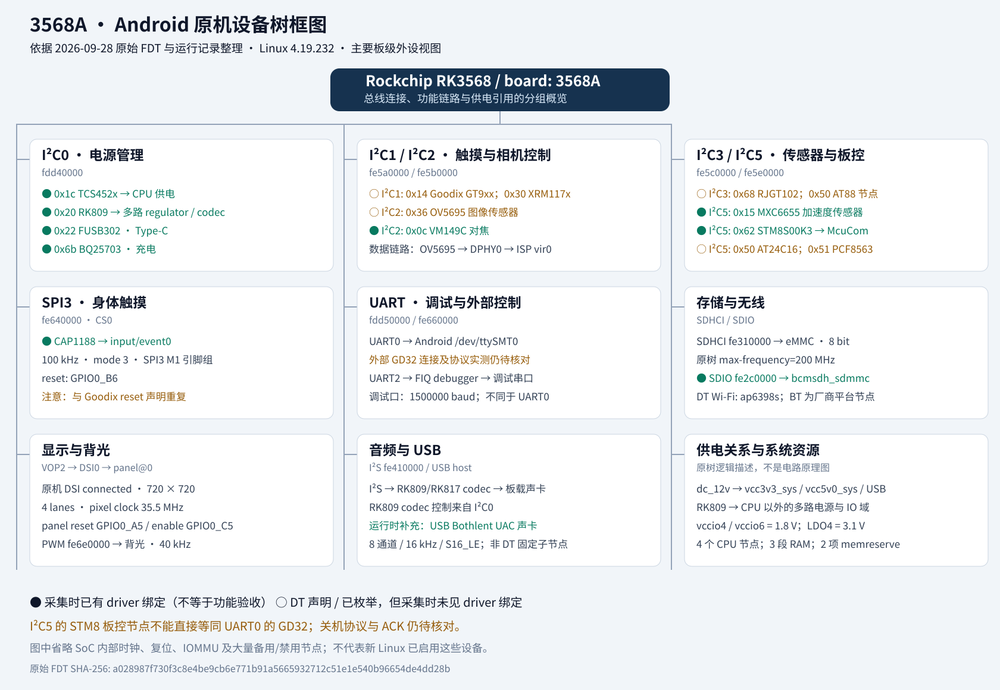

# 原机设备树框图

这是原 Android 的设备树与运行证据概览，不是 firstboot 候选配置，也不是电气接线原理图。
框图按功能分组，未画出全部父子节点、备用设备和 SoC 内部控制器。总线地址均为十六进制。
绿色实心标记表示采集时已绑定驱动，黄色空心标记表示声明/枚举存在但未见绑定；其余条目直接注明证据层次。
USB声卡为运行时枚举补充，不能从静态设备树还原其型号。

来源：本地 `outputs/android-board-20260928/android-running.dts`、`bundle/extra/buses.txt`，以及
[设备树初读](../../../../outputs/android-board-20260928/device-tree-review.md)和[采集报告](../../../../outputs/android-board-20260928/README.md)。
原始文件不随 Git 分发；图中没有设备序列号、MAC 或其他唯一标识。

此次复核确认：`/i2c@fe5e0000/mcuinf@62` 的 compatible 是 `smdtmcu,STM8S00K3`，
`/sys/bus/i2c/devices/5-0062` 已绑定 `McuCom`。这是已有采集证据，不能再笼统称 MCU 接口完全未知。
但它与关机日志函数的源码对应、内部寄存器/协议、ACK 和电源动作效果仍未确认；也不能等同于 UART0 上的 GD32。

重生成：`python3 platforms/rk3568/boards/aiot-3568pq/render-device-tree.py`。
SVG 是可缩放矢量图，使用中文系统字体显示；绘图脚本为人工核对后的概览，不是通用 DTS 自动解析器。
